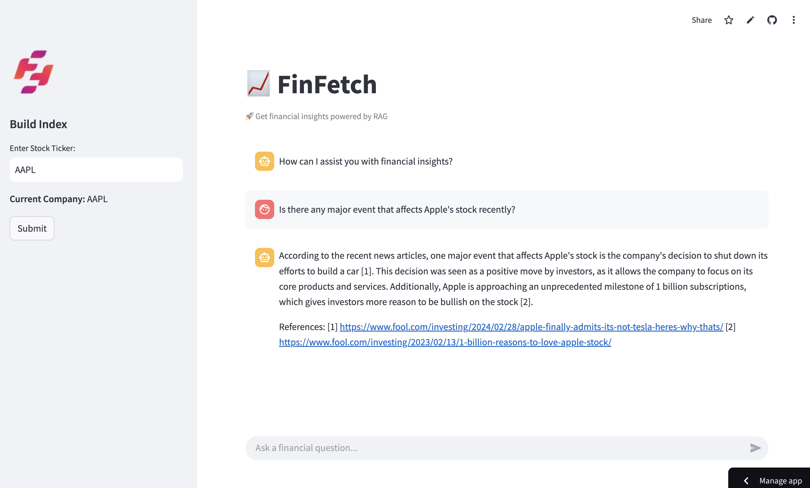
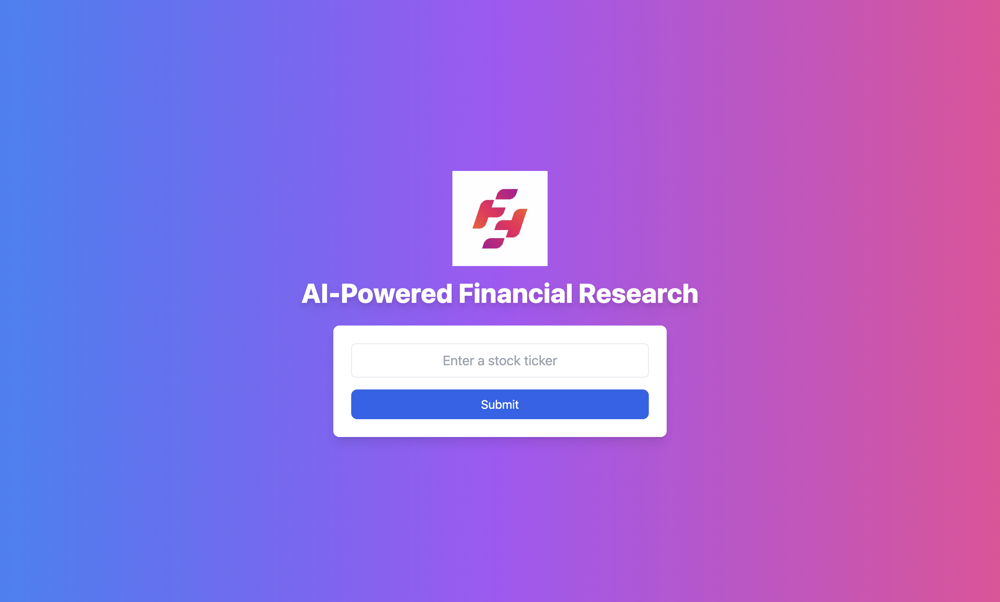
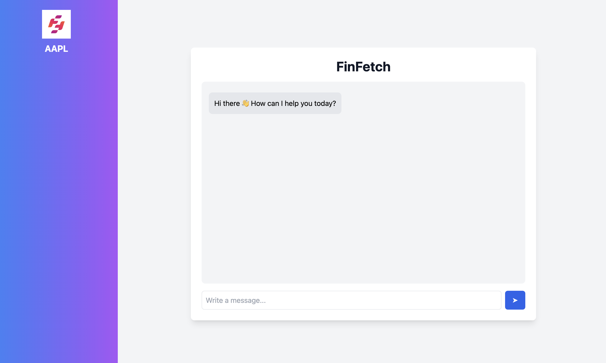

# Finfetch: Financial Research Tool
Finfetch is a user-friendly RAG-based LLM tool designed for effortless information retrieval. Leveraging company financial news as external database, it can assist with financial news summary, equity research, and more.

**Demo**: [Streamlit App](https://finfetch.streamlit.app/)

# Features
- Input a stock ticker to fetch financial articles from Alpha Vantage API
- Process article contents through LangChain's UnstructuredURL Loader
- Construct an embedding vector using Hugging Face's embeddings and create FAISS Index database to enable swift and effective retrieval of relevant information
- Encode user's question and retrieve relevant article information
- Incorporate retrieved information and company overview through prompt engineering
- Full stack web app with streaming response 

# Installation
We have created 2 versions, one with a fullstack architecture with a separate front and backend, and another using streamlit architecture.

## Version 1 (Streamlit)



1.Clone this repository to your local machine using:

```bash
  git clone git@github.com:wenqingmao/finance-rag-project.git
```
2.Navigate to the project directory:

```bash
  cd finance-rag-project
```
3.Install the required dependencies using pip:

```bash
  pip install -r streamlit/requirements.txt
```
4.Set up your Alpha Vantage and OpenRouter keys by creating a .env file in the streamlit folder

```bash
  ALPHA_VANTAGE_API_KEY = your_api_key_here
  OPEN_ROUTER_API_KEY = your_api_key_here
  TOKENIZERS_PARALLELISM=false
```
5.Run the Streamlit app by executing:
```bash
  streamlit run streamlit/streamlitApp.py
```
## Version 2 (Next.js + Python)




```bash
  git clone git@github.com:wenqingmao/finance-rag-project.git
```
2.Navigate to the project directory:

```bash
  cd finance-rag-project
```
3.Install the required dependencies using pip:

```bash
  pip install -r backend/requirements.txt
```
4.Set up your Alpha Vantage and OpenRouter keys by creating a .env file in the backend folder

```bash
  ALPHA_VANTAGE_API_KEY = your_api_key_here
  OPEN_ROUTER_API_KEY = your_api_key_here
  TOKENIZERS_PARALLELISM=false
```
5.Run the backend by executing:
```bash
  python server.py
```
6.Set up .env.local file to listen to the backend host
```bash
  NEXT_PUBLIC_BACKEND_URL=http://localhost:8000 
```

7.Run the frontend by executing:
```bash
  npm run dev
```

# Alpha Vantage 
This project uses the Alpha Vantage API as the financial data provider. Note that free Alpha Vantage API keys are limited to 25 requests/day. You can request your own API key [here]:https://www.alphavantage.co/support/#api-key

# OpenRouter
OpenRouter is a platform that provides a unified interface for accessing and integrating multiple large language models (LLMs). For this project, we used llama-3.3-70b-instruct:free model. You can request your own API key [here]:https://openrouter.ai/docs/api-reference/authentication